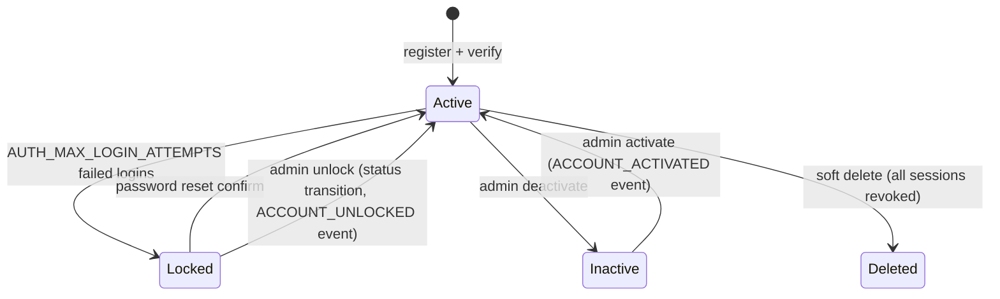

# Authentication Flows

Sequence diagrams for the identity flows. All timestamps/durations are driven by
`config/settings/base.py` — see `docs/AUTH_CONFIG.md`.

## 1. Registration + email verification

```mermaid
sequenceDiagram
    participant C as Client
    participant API as Auth API
    participant SVC as Registration/Verification Service
    participant DB as PostgreSQL
    participant Q as Celery/Redis
    participant M as Mailer

    C->>API: POST /auth/register/ {email, first_name, password}
    API->>SVC: register(...)
    SVC->>DB: check email (incl. soft-deleted) — conflict? 409 email_taken
    SVC->>DB: create User(status=pending_verification, email_verified=false)
    SVC->>DB: seed PasswordHistory (initial password)
    SVC->>Q: enqueue send_verification_code_email
    Q->>M: deliver 6-digit OTP
    API-->>C: 201 {user, verification_sent: true}
    C->>API: POST /auth/email/verify/confirm/ {email, code}
    API->>SVC: verify_email(user, code)
    SVC->>DB: token hash matched (SHA-256, constant-time)
    SVC->>DB: consume token; User → status=active, email_verified=true
    API-->>C: 200 {email_verified: true}
```

Notes:
- Only the most recent code per user+kind is valid; requesting a new one
  consumes the previous.
- Wrong codes increment the token's attempt budget; exhausting it returns
  `429 too_many_verification_attempts` and the code must be re-requested.

## 2. Login, refresh, logout

```mermaid
sequenceDiagram
    participant C as Client
    participant API as Auth API
    participant SVC as AuthService
    participant DB as PostgreSQL
    participant BL as JWT Blacklist

    C->>API: POST /auth/token/ {email, password}
    API->>SVC: login(...)
    SVC->>DB: account state? (locked → 423, inactive → 403, unverified → 403)
    alt bad password
        SVC->>DB: failed_login_attempts += 1 (persists on error path)
        SVC->>DB: record login_failed event
        alt attempts >= AUTH_MAX_LOGIN_ATTEMPTS
            SVC->>DB: status=locked; enqueue lockout notice email
            API-->>C: 423 account_locked
        else
            API-->>C: 401 invalid_credentials
        end
    else valid
        SVC->>DB: reset failed attempts; record login_success
        SVC->>DB: create LoginSession(refresh_jti) — cap evicts oldest
        API-->>C: 200 {access, refresh, user, session_id}
    end

    C->>API: POST /auth/token/refresh/ {refresh}
    API->>SVC: refresh(...)
    SVC->>DB: session active by jti? no → 401 token_revoked
    SVC->>BL: blacklist old token (rotation)
    SVC->>DB: slide LoginSession to new jti; record token_refreshed
    API-->>C: 200 {access, refresh}

    C->>API: POST /auth/logout/ {refresh}
    API->>SVC: logout(...) — decode jti unverified (expired tokens too)
    SVC->>DB: revoke LoginSession; blacklist jti; record logout
    API-->>C: 200
```

Security properties:
- Unknown email and wrong password produce the **same** `invalid_credentials`
  response; a constant-time dummy hash equalizes timing.
- Refresh is refused once the session ledger marks the token revoked — even if
  the JWT itself has not expired (instant logout / password-change / lockout).
- Lockout counters are written outside the success-path transaction so failed
  logins cannot be "lost" by an error rollback.

## 3. Password reset (anonymous)

```mermaid
sequenceDiagram
    participant C as Client
    participant API as Auth API
    participant SVC as VerificationService
    participant DB as PostgreSQL
    participant M as Mailer

    C->>API: POST /auth/password/reset/request/ {email}
    API->>SVC: request_password_reset(email)
    alt account found
        SVC->>DB: issue password_reset token (consumes previous)
        SVC->>M: email reset code
    else unknown email
        API-->>C: 200 (identical response — no enumeration)
    end
    API-->>C: 200

    C->>API: POST /auth/password/reset/confirm/ {email, code, new_password}
    API->>SVC: reset_password(...)
    SVC->>DB: code valid? (attempt budget enforced)
    SVC->>DB: set new password; record in history (reuse window)
    SVC->>DB: unlock if locked; revoke all sessions
    API-->>C: 200
```

## 4. Password change + reuse prevention

```mermaid
sequenceDiagram
    participant C as Client (authenticated)
    participant API as Auth API
    participant SVC as PasswordService
    participant DB as PostgreSQL

    C->>API: POST /auth/password/change/ {current_password, new_password}
    API->>SVC: change_password(...)
    SVC->>DB: current_password matches? no → 400 incorrect_current_password
    SVC->>DB: new_password in recent history? yes → 422 password_reuse
    SVC->>DB: set_password; push to history; trim to AUTH_PASSWORD_HISTORY_SIZE
    SVC->>DB: revoke ALL sessions (ledger + blacklist)
    API-->>C: 200 (client must re-authenticate)
```

## 5. Account lockout lifecycle



Every state transition (`locked→active`, `inactive→active`) is captured as a
`SecurityEvent` by `apps/authentication/signals.py`, and locks/deactivations
revoke every live session.
